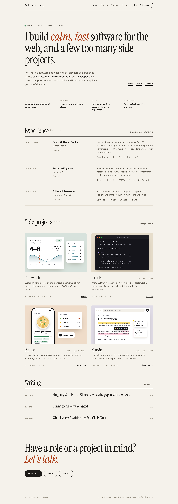
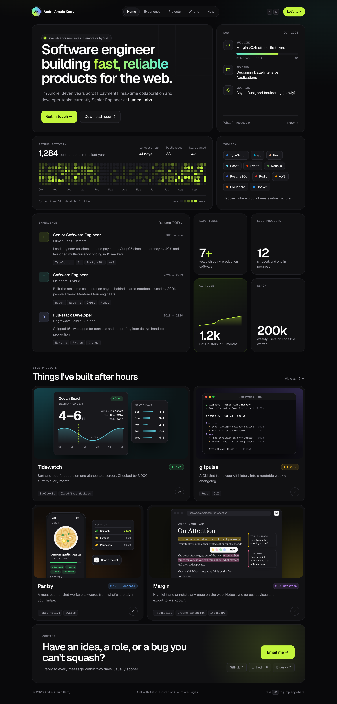


# Design demos

Three visual directions for the site. They're static mockups (pictures, not code), so we can pick a direction before building anything. All three use **the same placeholder content** (made-up jobs, projects and numbers), so the comparison is about design, not copy.

Each demo has a full-page desktop render (1440 px wide) and a mobile render (390 px wide), both at 2× resolution.

| 1 · Editorial | 2 · Bento | 3 · Bold |
| :---: | :---: | :---: |
|  |  |  |
| [Desktop](1-editorial.png) · [Mobile](1-editorial-mobile.png) | [Desktop](2-bento.png) · [Mobile](2-bento-mobile.png) | [Desktop](3-bold.png) · [Mobile](3-bold-mobile.png) |

## How they compare

| | 1 · Editorial | 2 · Bento | 3 · Bold |
| --- | --- | --- | --- |
| **Feel** | Calm, classic, content-first | Modern, dense, technical | Playful, confident, memorable |
| **Theme** | Light: warm paper, ink, one vermilion accent | Dark: near-black cards, lime accent | Light: cream, thick outlines, hard shadows, five bright colours |
| **Type** | Instrument Serif, Instrument Sans, IBM Plex Mono | Geist, Geist Mono | Bricolage Grotesque, Space Mono |
| **Layout** | Single column, hairline rules, table-like rows | 12-column grid of cards | Stacked sections, sticker-style cards, marquee "tapes" |
| **Extra sections shown** | Writing | Now, GitHub activity, stats | About, toolbox, testimonial |
| **Best if you want…** | The work and the writing to do the talking | To show a lot at a glance | To stand out and be remembered |
| **Trade-offs** | Quieter; relies on strong project write-ups and screenshots | Busy; needs real data (GitHub, stats) to feel alive | Loud; harder to keep accessible contrast, and may date faster |

## Notes
- **Sections are interchangeable.** For example, the Writing list from 1, the "Now" card from 2 or the testimonial from 3 can go into any direction.
- **Each demo is shown in its "home" theme.** Whichever direction we pick, the [requirements](../REQUIREMENTS.md#4-design-and-ux) call for both light and dark themes.
- **Project thumbnails are drawn, not real screenshots.** They'd be replaced with real screenshots of each project.
- The images were rendered from throwaway HTML mockups with headless Chrome. None of that code is meant for production.
